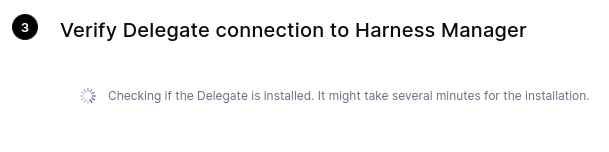
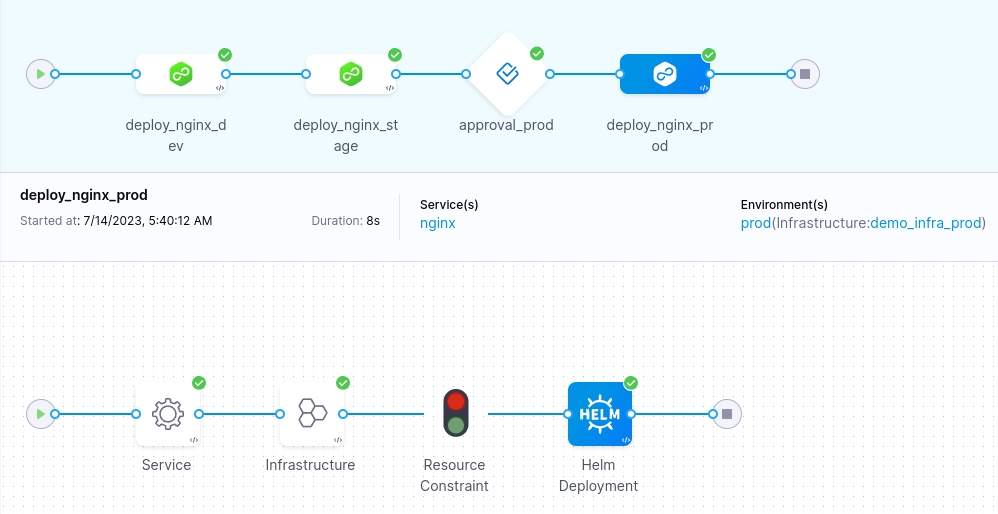

# Demo

For this demo we will be using a variety of tools to deploy nginx.

## Minikube Configuration Notes

My host is Fedora 38 on a workstation. To facilitate local development the following operations have been completed.

### We'll be using minikube from the Google Cloud SDK

`$ dnf install google-cloud-sdk-minikube`

### Setting minikube to use rootless mode to avoid possible security problems with the demo environment.

`$ minikube config set rootless true`

### Starting Minikube with podman (a docker alternative packaged by Red Hat/Fedora) using the containerd runtime.

`$ minikube start --driver=podman --container-runtime=containerd`

### Verifying our context was added to kubectl and is selected

`$ kubectl config get-contexts`

```
CURRENT   NAME                                              CLUSTER                                           AUTHINFO                                          NAMESPACE
*         minikube                                          minikube                                          minikube                                          default
```

Next we will switch over to terraform to begin IaC practices for creating our project dependencies

## Terraform

The terraform files within this project are structured with best practices in mind.

`$ touch main.tf outputs.tf variables.tf versions.tf`
`$ git add main.tf outputs.tf variables.tf versions.tf`

`main.tf`: Our project file

`versions.tf`: Our provider dependencies with versions

`outputs.tf`: Outputs from our operations

`variables.tf`: Declarations and default values for our project variables

**Please see the files within the project for complete resources. Only notable resources will be shown here.**

We will version lock and initialize the kubernetes provider

```
terraform {
    required_providers {
      kubernetes = {
        version = "= 2.22.0"
      }
    }
}
```

Configure it for our minikube context

```
provider "kubernetes" {
    config_path = "~/.kube/config"
    config_context = "minikube"
}

```

And update .gitignore to omit the .terraform configuration directory and lock files.

Next we will create 3 resources in main.tf to include `dev`, `stage`, `prod` namespaces (see main.tf) and begin Harness Configuration.

## Harness Configuration (delegate)

Similar to the kubernetes provider, we will add the Helm provider to our terraform (see versions.tf). Instructions for installing the Harness Delegate chart are available in the project after logging in.

**Harness credentials are stored in a local .tfvars file that is in .gitignore to avoid exposing secrets**

After `terraform apply` we can sanity check the helm chart installation.

```
$ kubectl get pods -n harness-delegate-ng
NAME                                READY   STATUS    RESTARTS   AGE
harness-delegate-69df6f6574-q59h7   1/1     Running   0          74s
```

## Harness Configuration (web UI)

We will wait for the connection to be established with the Harness Manager.



And we should be ready to make some deployments!

### Creating an API key for terraform

Heading over to Harness and navigating to _Account Settings -> Access Control -> Service Accounts_ allows us to create an API key for terraform.

You will also need your account ID (present in the URL, see docs at [Harness Terraform Provider](https://developer.harness.io/docs/platform/resource-development/terraform/harness-terraform-provider/))


### Terraform resources

Resources were created with a liberal amount of `terraform import` and provider [documentation](https://registry.terraform.io/providers/harness/harness/latest/docs)

### Extra configuration

The project includes individual pipelines for each environment. There is also an _omni_ pipeline that includes all 3 environments and an approval. The `when` clause is used to avoid pushing non-working code to staging and, of course, prod.

Example `when` clause:
```
            - stage:
                name: deploy_nginx_stage
                identifier: deploy_nginx_stage
                description: "Deploy nginx to stage"
            ...
                tags: {}
                failureStrategies:
                  - onFailure:
                      errors:
                        - AllErrors
                      action:
                        type: StageRollback
                when:
                    pipelineStatus: Success
```

This constraint is visible in the Harness UI.



## Wrapping up

After the run we can see the helm releases that Harness has managed.

```
$ helm list -A
NAME                                            	NAMESPACE          	REVISION	UPDATED                                	STATUS  	CHART                     	APP VERSION
harness-delegate                                	harness-delegate-ng	1       	2023-07-14 04:50:46.942881093 -0500 CDT	deployed	harness-delegate-ng-1.0.11	1.16.0     
release-43182ef1f0a2233ca3fce3c24821f86b0c1621c2	dev                	1       	2023-07-14 10:39:49.789308013 +0000 UTC	deployed	nginx-15.1.1              	1.25.1     
release-a1e9d5da9336ffa24fb709662245f7e7ed5f71c0	stage              	1       	2023-07-14 10:39:56.439598871 +0000 UTC	deployed	nginx-15.1.1              	1.25.1     
release-a531c43d1636d567168efb72b0afb389d19c0b00	prod               	1       	2023-07-14 10:40:18.636709692 +0000 UTC	deployed	nginx-15.1.1              	1.25.1  
```